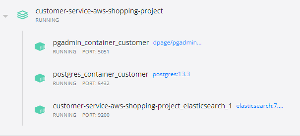

#AWS Shopping Service Project

Welcome to AWS Shopping Service Project! This project is designed to launch an online store system on AWS services. The project consists of two microservices: admin service and customer service. This module represents customer service.

#Customer-service
This service is designed to provide services for receiving, filtering goods. The service provides the ability to add goods to the basket / several baskets, as well as placing an order based on the goods in the basket.

SWAGGER API for customer service described on **CustomerServiceSwagger** at the root of project

#Interaction Scheme 

#Getting started with Customer service of AWS Shopping Service Project
- Install Java 11
  For Windows: https://www.oracle.com/technetwork/java/javase/downloads/jdk8-downloads-2133151.html
  Add bin files to environment variable PATH
  For UNIX: https://openjdk.java.net/install/
- Install git: https://git-scm.com/downloads
- Install Docker https://docs.docker.com/desktop/windows/install/
- Read about AWS services: SNS, SQS, RDS, ElasticSearch, EC2 https://docs.aws.amazon.com/index.html?nc2=h_ql_doc_do

#How to run the Customer service locally
After completing the previous steps:
1. Clone repository
2. Run services in docker containers via docker-compose:
- Run ***docker-compose up*** in Customer-Service-AWS-Shopping-Project folder. It will start RabbitMq, elasticsearch, postgres and pgadmin in containers.

The started services in docker desktop should look like this:

Available addresses for interaction: 

| Services  | Addresses  |
| ------------- | -------------        |
| RabbitMq  | http://localhost:15672  |
| ElasticSearch  | http://localhost:9200  |
| PgAdmin Customer  | http://localhost:5051  |

3. Set environment variables:
- spring.datasource.username=user;
- spring.datasource.password=pass;
- spring.profiles.active=local;
4. The project can be started!
